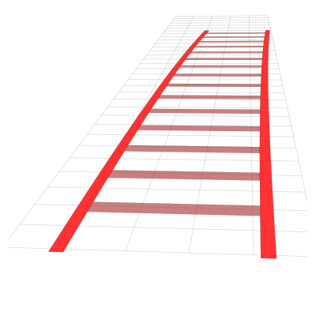
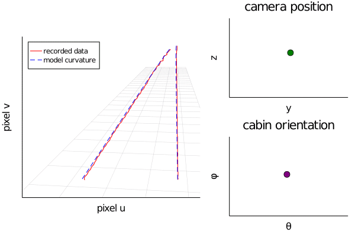
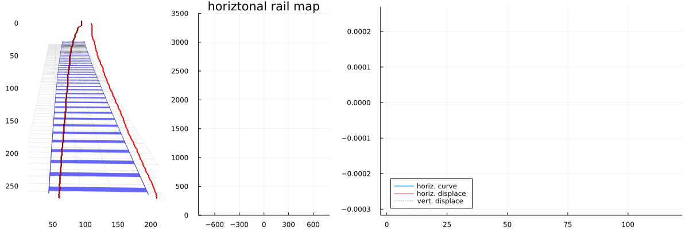

# TrainView.jl

A Julia package to model and interpret how a camera on a train sees the tracks ahead. The camera is assumed to be fixed on the train, but the train can move relative to the tracks in any direction.

Currently the package can **model** how the tracks should appear in a camera image, red tracks shown below. And given the positions of the track, **predict** how the train car has moved.





Below shows how we can used the data from image recognition (red trackes) to predict what the camera would see if the train car was still relative to the tracks, and predict the track curvature and train car displacement. As we have the curvature, we can also calculate a map of the rail


## An example

To process many frames, each with a large number of points on each track, such as `data/output_results_centre_line.csv`, go to the terminal, navigate to the same folder as this code, and execute
```
> julia --project track_to_cabin_movement.jl data/output_results_centre_line.csv data/output.csv data/camera_track.csv
```
where the third argument is optional. Or open the julia REPL
```
> julia --project
```
 and then run the code
```julia
include("track_to_cabin_movement.jl")
track_to_cabin_movement("data/output_results_centre_line.csv","data/output.csv"; setup_output_file = "data/camera_track.csv")
```
where `output_results_centre_line.csv` is a data file with the track points on images, i.e. see the format of `data/output_results_centre_line.csv`,`data/camera_track.csv` is where the code will save the camera and track properties used, and `output.csv` is an output file name with the format:

|Y	|Z	|θT |φT |α  |	β  |
|---|---|---|---|---|---|
|-0.0027	|0.035	|-0.0019	|-0.0026	|0.00012	|0.0004|
|-0.0038	|0.011	|-0.0009	|-0.0023	|0.00009	|0.0004|
|-0.00035	|0.0072	|-0.0002	|-0.0016	|0.00005	|0.00005|
| .	| .	| .	| .	| .	|.|
| .	| .	| .	| .	| .	|.|
|0.0088	|-0.0050	|0.0006	|0.0005|	0.0001	| 0.0009|

where each row corresponds to one frame. To explain the columns we first need a coordinate system (X,Y,Z), where X is aligned with the tracks, and pointing forward and Z points towards the ground.

The columns show how much the train car is displaced from being aligned with the tracks. That is, if the values in one row are all zero, then the train is complete aligned with the tracks, and the suspension is in its position of rest. Y and Z are the displacements of the train car in the Y and Z direction, θT and φT are the pitch and yaw of the train car, while α and	β are the vertical and horizontal curvature.

## Camera calibration

Ideally, you should know the position and tilts of your camera and it's focal length[^1], or have a good guess. While it is impossible to estimate all these parameters, it is possible to estimate the camera position and tilt from the data. This is a nonlinear solver, so the initial guess is important.

To help make a guess, we first need to understand our coordinate system. The origin of the coordinate system is on the floor, centred relative to the train, usually directly below the camera. The axis are such that $x$ is straight ahead of the train, $z$ is down, and $y$ is to the right (starboard).

Next we can guess the $xyz$ position of the camera by looking at the first frame of the data
```julia
frames, uv_data = load_uv_data("data/output_results_centre_line.csv";
    sensor_width = 960, sensor_height = 540,
);

# Choose only the first frame
uv = uv_data[1]

using Plots
gr(yflip = true)

# Plot the left track
plot(uv[1],uv[2], lab = "left track")

# Plot the right track
plot!(uv[3],uv[4], lab = "right track")
```

From this, and the choice of our coordinate system we can guess:
```julia
camera_xyz = [0.0,0.5,-2.5]
```
We can also specify `ψθφ`, the camera's roll, pitch, and yaw. But this can be guessed automatically just by assuming that the camera is point at the tracks far ahead[^2].

[^2]: It is best not to have the camera pointing straight ahead, as then the tracks in the middle of the camera image are infinitely far away.

```julia
camera = calibrated_camera(uv_data;
    trackprop = TrackProperties(track_gauge = 1.435 + 0.065),
    camera_xyz = camera_xyz,
    sensor_width = 960, sensor_height = 540
)
```
which will return `camera`, which is calibrated to the data provided. You could then call
```julia
julia> include("track_to_cabin_movement.jl")
julia> track_to_cabin_movement("data/output_results_centre_line.csv","data/output.csv"; camera = camera, sensor_width = 960, sensor_height = 540)
```
to use this calibrated 'camera', or any 'camera' or your choosing. NOTE: if you do not specify a camera, such as in the section above, then the code will attempt to calibrate a camera from the data provided.

[^1]: Technically the package needs the focal_length x pixels_per_meter. Many just call this the focal length.

## Execution speed

Julia has a rather large overhead when first initializing. That means the line
```julia
julia> include("track_to_cabin_movement.jl")
julia> @time track_to_cabin_movement("data/output_results_centre_line.csv","data/output.csv")

Data saved as a CSV file in data/output.csv
 29.429744 seconds (107.34 M allocations: 5.266 GiB, 4.69% gc time)
```
but if now run the same function again, without closing julia, then, even if we used different data, the code will run much faster:
```julia
julia> @time track_to_cabin_movement("data/output_results_centre_line.csv","data/output.csv")

Data saved as a CSV file in data/output.csv
  3.36651 seconds (63.07 M allocations: 3.257 GiB, 13.45% gc time)
```
